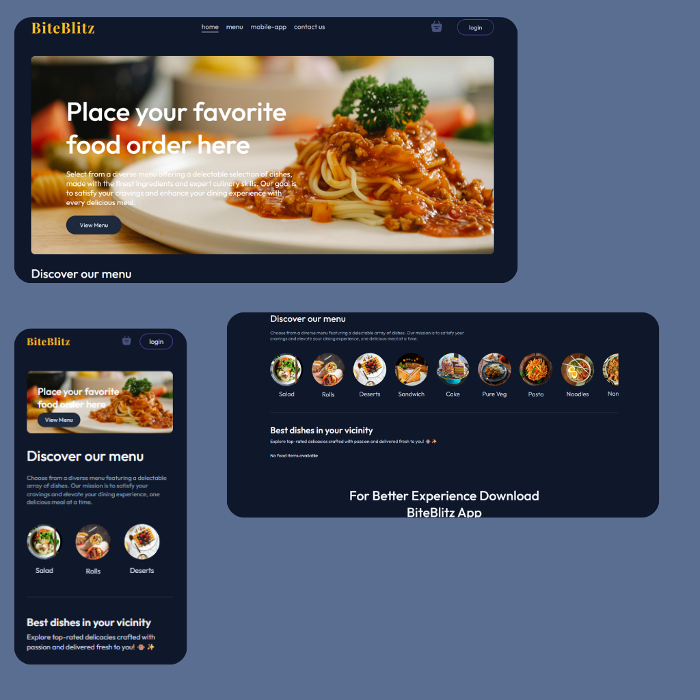
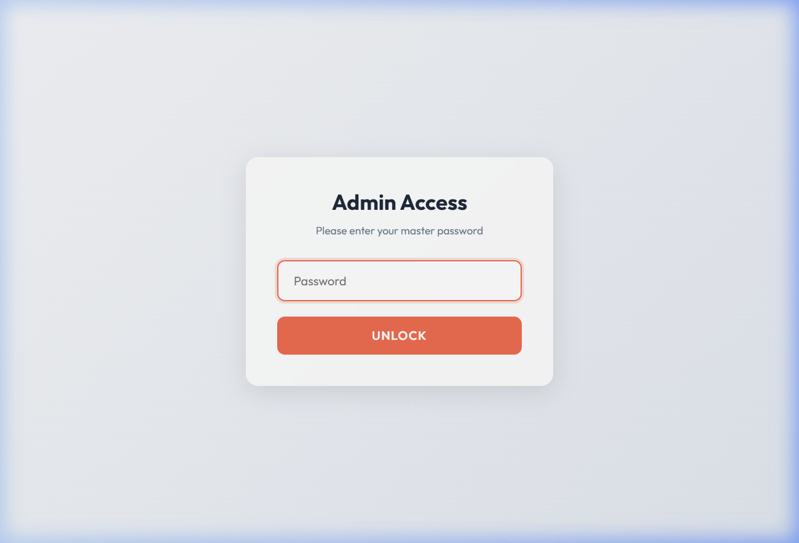
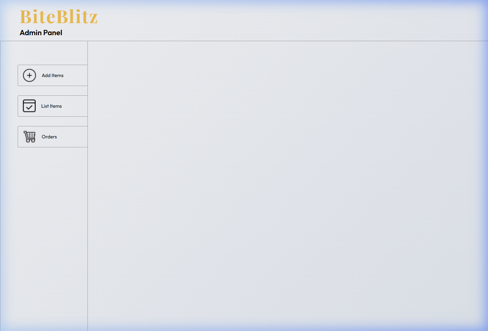
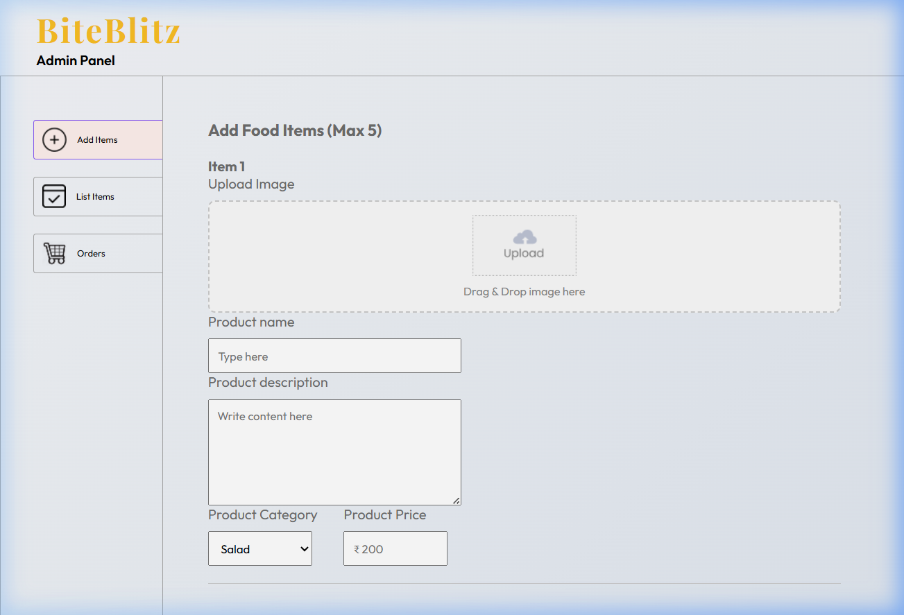

# BiteBlitz

A simple food ordering app with three parts:

- frontend for users
- admin panel for management
- backend API

Live:

- User app: https://biteblitz-six.vercel.app/
- Admin app: https://biteblitzadmin.vercel.app/

## What it does

- User signup/login
- Browse food items
- Add/remove items in cart
- Place orders and verify payments
- View user order history
- Admin can add/remove food items
- Admin can view orders and update status

## Project folders

- frontend
- admin
- backend

## Run locally

1. Clone the repo

git clone https://github.com/tanisshqbhardwwaj/BiteBlitz.git
cd BiteBlitz-main

2. Install dependencies

cd backend
npm install
cd ../frontend
npm install
cd ../admin
npm install

3. Create backend env file in backend/.env

MONGODB_URI=your_mongodb_connection_string
JWT_SECRET=your_jwt_secret
STRIPE_SECRET_KEY=your_stripe_secret_key
FRONTEND_URL=http://localhost:5173

4. Create frontend env file in frontend/.env

VITE_API_URL=http://localhost:8000

5. Create admin env file in admin/.env

VITE_API_URL=http://localhost:8000

6. Start backend

cd backend
npm run server

7. Start frontend (new terminal)

cd frontend
npm run dev

8. Start admin (new terminal)

cd admin
npm run dev

Backend runs on port 8000 by default.

## Screenshots

